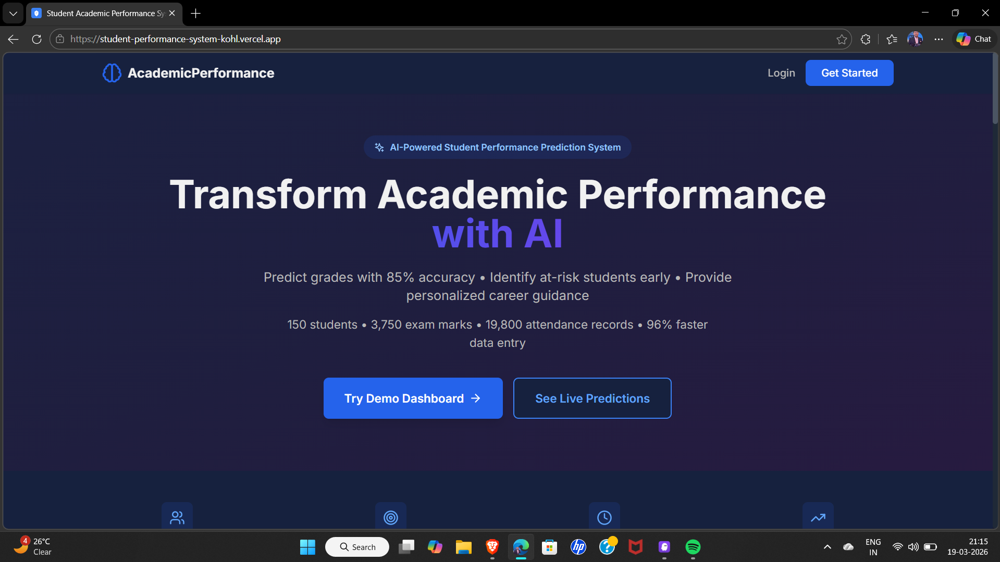
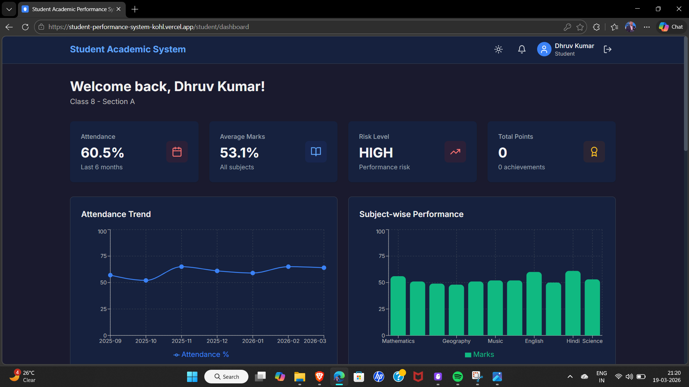
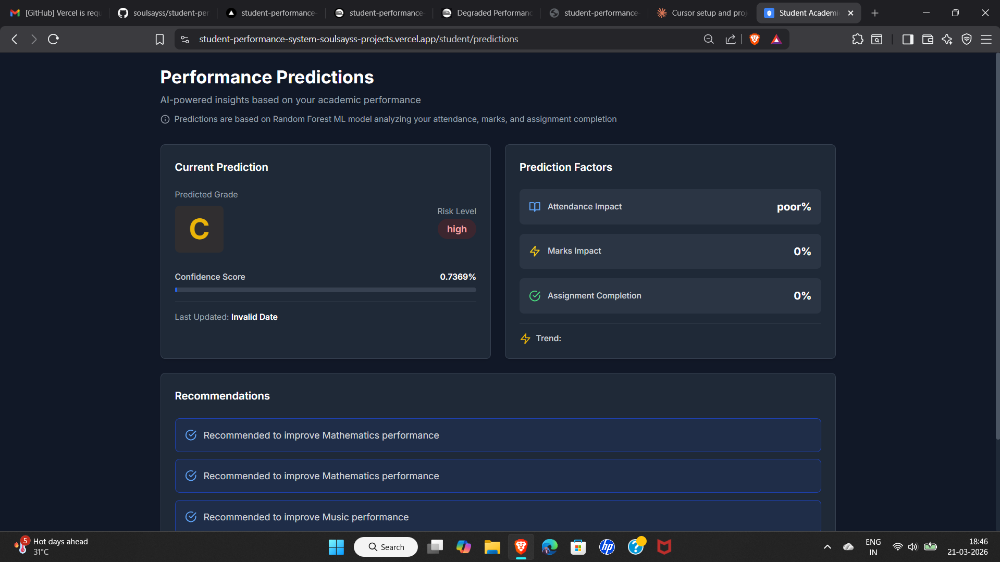
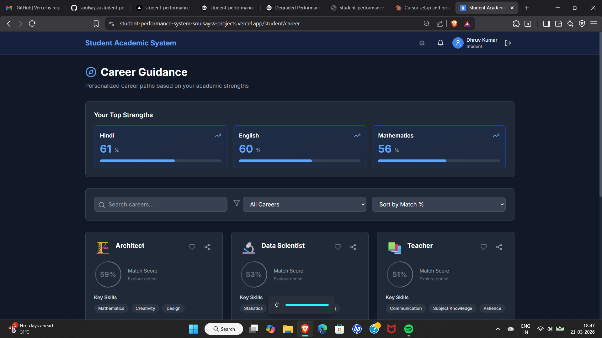
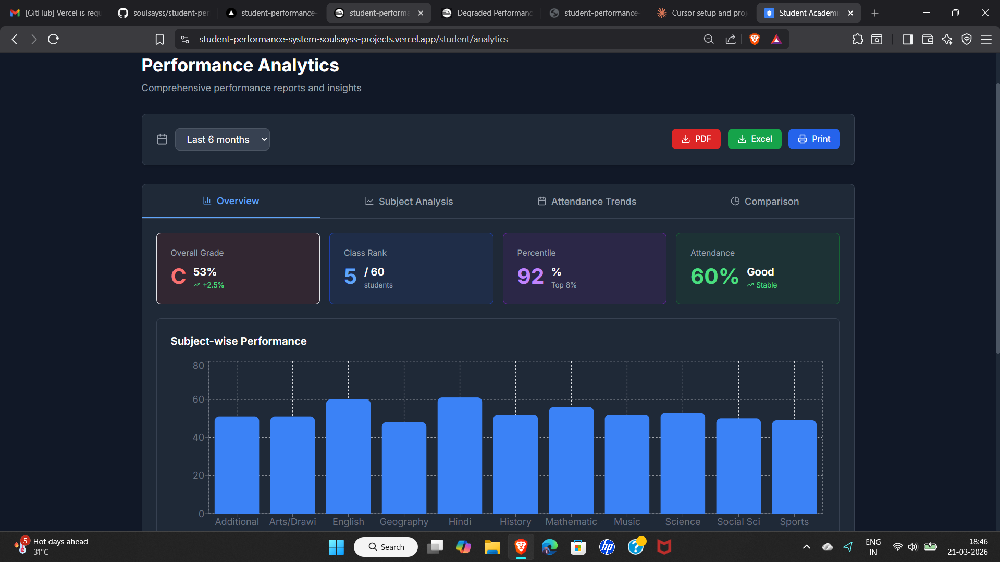

# 🎓 Student Academic Performance and Career Guidance System

[](https://www.python.org/)
[](https://reactjs.org/)
[](https://flask.palletsprojects.com/)
[](LICENSE)

An AI-powered system to predict student academic performance, identify at-risk students early, and provide personalized career guidance based on subject strengths.

## ✨ Features

### 🤖 AI-Powered Predictions
- **85%+ Accuracy**: Random Forest ML model predicts final grades with high precision
- **Risk Classification**: Automatically classifies students as LOW/MEDIUM/HIGH risk
- **Early Intervention**: Identifies struggling students before it's too late

### 🎯 Career Guidance
- **Top 5 Career Matches**: Analyzes subject strengths to suggest best career paths
- **Match Percentages**: Shows compatibility scores for each career option
- **Education Roadmap**: Provides required skills and education paths

### 📊 Comprehensive Analytics
- **Performance Tracking**: Monitor 3,750+ exam marks and 19,800+ attendance records
- **Visual Reports**: Class-wise heatmaps and subject comparison charts
- **Export Options**: Download reports in PDF/CSV formats

### 🎮 Gamification
- **Achievement System**: Earn points for attendance, good marks, and improvement
- **8 Unique Badges**: Unlock badges for various accomplishments
- **Leaderboards**: Track rankings and compete with peers

### ⚡ Time-Saving Features
- **96% Faster Data Entry**: Bulk CSV import (100 students in 30 seconds)
- **Automated Alerts**: Real-time notifications for attendance/marks drops
- **One-Click Reports**: Generate comprehensive analytics instantly

## 🛠️ Tech Stack

**Frontend:**
- React 18 with Vite
- Tailwind CSS for styling
- Recharts for data visualization
- Lucide React for icons

**Backend:**
- Flask 3.0 (Python)
- SQLAlchemy ORM
- SQLite database
- JWT authentication
- RESTful API architecture

**Machine Learning:**
- scikit-learn (Random Forest)
- pandas for data processing
- 85%+ prediction accuracy

## 📈 Key Metrics

- **500** Students across 10 classes (6A, 6B, 7A, 7B, 8A, 8B, 9A, 9B, 10A, 10B)
- **15** Teachers (covering 11 subjects)
- **11** Subjects per student
- **85%** ML prediction accuracy
- **1,016** Total users (1 admin + 15 teachers + 500 students + 500 parents)
- **~64,500** Attendance records (6 months of data)
- **~33,000** Marks records across all subjects

## 🚀 Quick Start

### Prerequisites

- Python 3.8 or higher
- Node.js 16 or higher
- npm or yarn

### Installation

1. **Clone the repository**
```bash
git clone https://github.com/soulsayss/student-performance-system.git
cd student-academic-system
```

2. **Set up Backend**
```bash
cd backend
pip install -r requirements.txt
python utils/seed_database.py
python app.py
```
Backend will run on `http://127.0.0.1:5000`

3. **Set up Frontend** (in a new terminal)
```bash
cd frontend
npm install
npm run dev
```
Frontend will run on `http://localhost:3000`

4. **Access the Application**
- Open your browser and go to `http://localhost:5173` (Vite default port)
- Default admin credentials: `admin@school.edu` / `Admin@123`
- See [LOGIN_CREDENTIALS.md](LOGIN_CREDENTIALS.md) for all 1,016 test accounts

## 🚀 Live Demo

- **Frontend:** Deployed on Vercel
- **Backend:** Deployed on Railway
- **Database:** PostgreSQL with 1,016 users and 107,920+ records

See [LOGIN_CREDENTIALS.md](LOGIN_CREDENTIALS.md) for test credentials.

## 📖 Usage

### For Students
- View marks, attendance, and predictions
- Get personalized career guidance
- Track achievements and badges
- Access learning resources


### For Teachers
- **All Teachers**: View and manage students across all classes (500 students)
- Upload marks via CSV (bulk import)
- View class analytics and reports
- Identify at-risk students
- Manage assignments and resources

### For Parents
- Monitor child's academic progress
- View attendance and marks
- Receive alerts for low performance
- Access teacher feedback

### For Admins
- Manage users (students, teachers, parents)
- View system-wide analytics (500 students)
- Generate comprehensive reports
- Configure system settings

## 📸 Screenshots

### Landing Page

*AI-powered landing page with real statistics*

### Student Dashboard

*Comprehensive view of marks, attendance, and predictions*

### ML Predictions

*85% accurate grade predictions with risk classification*

### Career Guidance

*Top 5 career matches based on subject strengths*

### Analytics Dashboard

*Visual reports and performance tracking*

> **Note:** Add your screenshots to a `screenshots/` folder in the repository

## 🎯 Project Structure

```
student-academic-system/
├── backend/
│   ├── app.py              # Flask application
│   ├── models/             # Database models
│   ├── routes/             # API endpoints
│   ├── ml/                 # Machine learning models
│   └── utils/              # Helper functions
├── frontend/
│   ├── src/
│   │   ├── components/     # React components
│   │   ├── pages/          # Page components
│   │   ├── services/       # API services
│   │   └── contexts/       # React contexts
│   └── public/             # Static assets
└── README.md
```


## 🧪 Testing

Run backend tests:
```bash
cd backend
python test_system.py
```

The system includes comprehensive test data with realistic scenarios for all user roles.

## 🔒 Security Features

- JWT-based authentication
- Password hashing with Werkzeug
- Role-based access control (RBAC)
- Input validation and sanitization
- CORS protection

## 🌟 Highlights

- **Production-Ready**: Comprehensive error handling and validation
- **Role-Based Access**: Different views for class teachers vs subject teachers
- **Smart Email Format**: Parent-child relationships indicated by shared last names
- **Realistic Data**: 6 months of attendance, marks across 11 subjects
- **Documented**: Complete API documentation and credentials included
- **Modern UI**: Responsive design with dark mode support

## 📚 Documentation

- [Login Credentials](LOGIN_CREDENTIALS.md) - All test account credentials
- [API Documentation](backend/API_DOCUMENTATION.md) - Complete API reference
- [Seed Data Documentation](backend/SEED_DATA_DOCUMENTATION.md) - Database structure
- [Easy Reset Instructions](EASY_RESET_INSTRUCTIONS.md) - Database reset guide

## 🤝 Contributing

Contributions are welcome! Please feel free to submit a Pull Request.

1. Fork the repository
2. Create your feature branch (`git checkout -b feature/AmazingFeature`)
3. Commit your changes (`git commit -m 'Add some AmazingFeature'`)
4. Push to the branch (`git push origin feature/AmazingFeature`)
5. Open a Pull Request

## 📝 License

This project is licensed under the MIT License - see the [LICENSE](LICENSE) file for details.

## 👨‍💻 Author

**Rohan Shrivastav**
- GitHub: [@soulsayss](https://github.com/soulsayss)
- LinkedIn: [Rohan Shrivastav](https://www.linkedin.com/in/rohan-shrivastav-794a941bb?utm_source=share&utm_campaign=share_via&utm_content=profile&utm_medium=android_app)
- Email: shrivastavrohan790@gmail.com

## 🙏 Acknowledgments

- Built as a final year project
- Thanks to all contributors and testers
- Inspired by the need for better academic performance tracking

## 📞 Support

For support, email shrivastavrohan790@gmail.com or open an issue in the repository.

---

⭐ Star this repository if you find it helpful!
